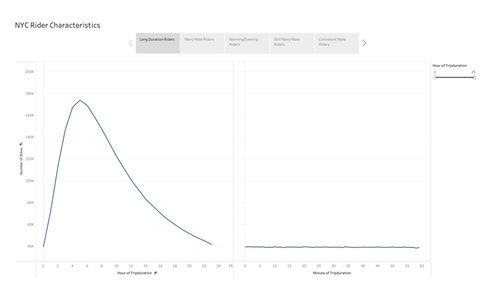
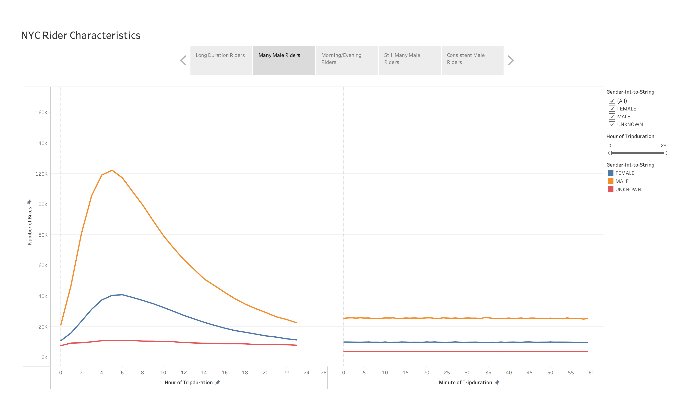
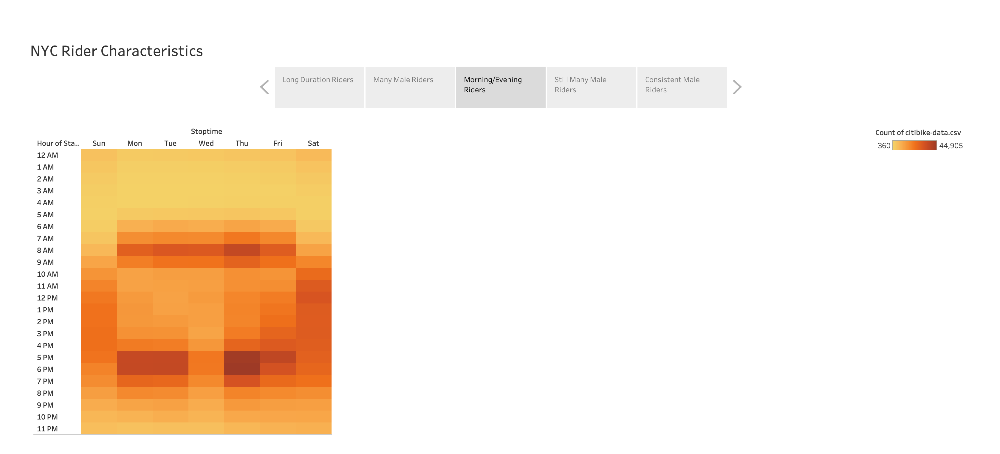
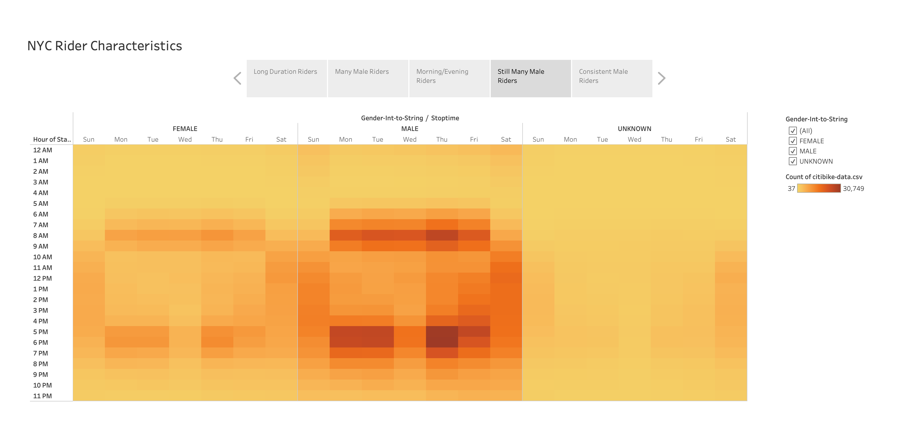
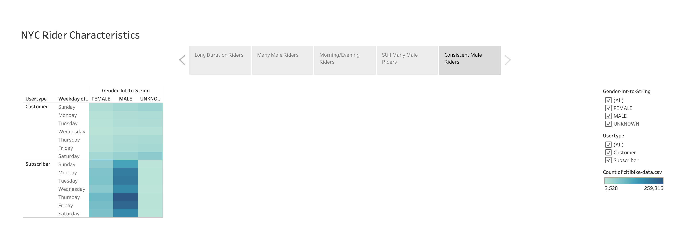
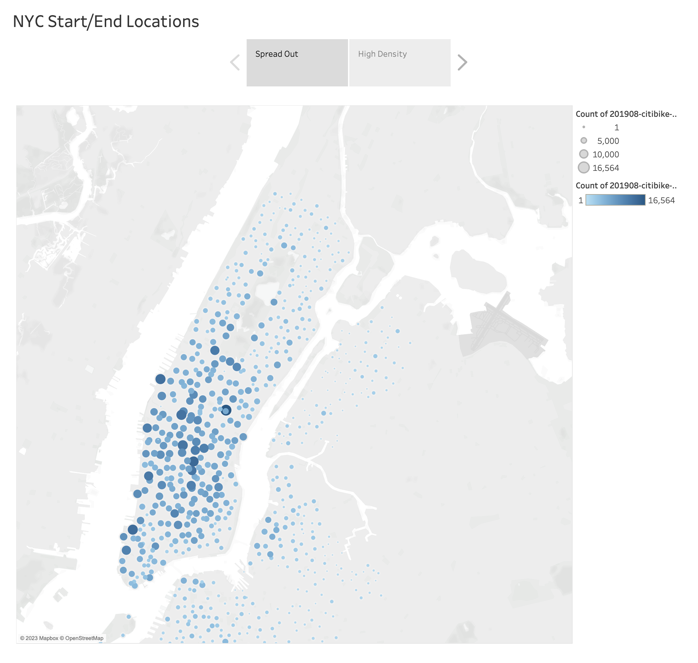
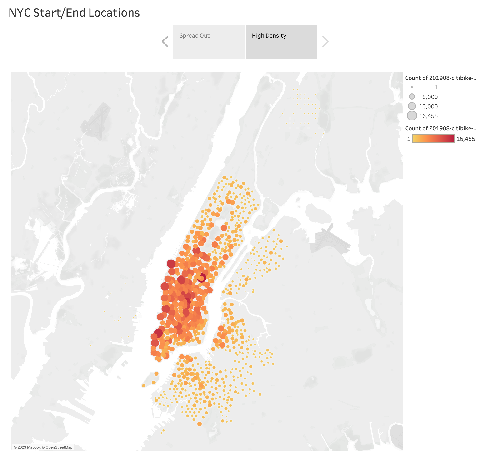

# NY Citibike with Tableau

## Overview

The purpose of this analysis is to use the data on citibike share in New York City (NYC) as a parameter to evaluate such a venture's potential in Des Moines, Iowa. We shall utilize Tableau to visualize this data so as to gain and present information that could help us identify the reasons for the service's use in NYC.

---

## Tableau Public Links

[Module Challenge](https://public.tableau.com/views/TableauModuleChallenge/NYCRiderCharacteristics?:language=en-US&:display_count=n&:origin=viz_share_link)

[Portion of Module Work](https://public.tableau.com/views/NYCitybikewithTableau-rajeev/NYCStartEndLocations?:language=en-US&:display_count=n&:origin=viz_share_link)

---

## Results

    

What’s apparent from the data is that a large number of bikers ride for 4-8 hours. This could indicate that the bikers are either riding recreationally or for long commute purposes.

 

    

A qualitative look at the previous chart shows that majority of the bikers are male. Considering the fact that New York City is a bustling city with a lot of construction and business, and that majority of the bikers are male, the bikers are most likely riding to commute for work purposes.

 

    

This chart confirms the assumption that most of the bikers are riding to commute. A high density of bikers are prevalent on week days and that too right before/after the 9-5 job cycle beings/ends. This shows that the bikers are commuting to their jobs.

 

    

This chart simply further details the previous chart but also solidifies the assumption that the high number of male bikers indicates the intent for riding to be for work commute.

 

    

Lastly, this chart indicated the reduced possibility of the bikers riding for recreational purposes. A high density of bikers being subscribers strengthens the case of the bikers riding to their jobs.

 

    
    

The previous two charts show that most bikers’ destinations is in the center of the city. And so, the bikers’ trip origins being more spread out indicates that the bikers are riding to the bustling center of the city for work.

---

## Summary

In conclusion, what is clear is that the majority of bikers in New York City ride for work purposes. I believe the fact that the majority of bikers being male is a result of the previous observation and not an indication that males are more likely to opt for such biking services. However, it is important to recognize that the motivation for using the biking services is most likely due to the traffic situation and commute mannerisms in New York City. Hence, for such a model to be successfully implemented in Des Moines, the motivation behind opting for such a service must be clear.

For future analysis, one could plot the start and end locations as a distance factor to observe how long the bikers ride continuously, and how it would compare to the projected ride paths/distances in Des Moines. One could also look closer at the biker characterisitics during the weekends to see if there's a better balance among the various genders that decide to ride then.